<h1 align="center">Web-LGSM</h1>

<h3 align="center">A basic web panel for the <a href="https://linuxgsm.com/">Linux Game Server Manager</a></h3>

<p align="center">
  <a href="./license.txt">
    
  </a>
  
  
  <a href="https://github.com/BlueSquare23/web-lgsm/releases">
    
  </a>
</p>
<p align="center">
  
  <a href="https://github.com/BlueSquare23/web-lgsm/issues">
    
  </a>
  <a href="https://github.com/BlueSquare23/web-lgsm/pulls">
    
  </a>
  <a href="https://github.com/BlueSquare23/web-lgsm/stargazers">
    
  </a>
  <a href="https://github.com/BlueSquare23/web-lgsm/network">
    
  </a>
</p>

---

> [!NOTE]
> The Web-LGSM is an independent fan project and is not affiliated with the official [LGSM Project](https://linuxgsm.com/).

---

## Overview

The Web-LGSM is a browser-based management interface for the [Linux Game Server Manager (LGSM)](https://linuxgsm.com/). LGSM is a powerful CLI tool for installing and running game servers. This application wraps that functionality in an accessible web UI, so you can manage your game servers without touching the command line.

## Features

- **One-click installs**: Browse the full LGSM catalog and install over 130+ game server directly from the UI
- **Live console output**: Watch commands execute in real time via the integrated web terminal
- **File manager**: Download, upload, edit, and manage files from the comfort of the browser
- **Schedule jobs**: Create scheduled jobs (updates, backups, restarts, etc) for your game servers through the web UI
- **Add existing servers**: Import LGSM installations that were set up outside of the Web-LGSM
- **Remote installs**: Add LGSM game servers that are installed on remote machines and admin them through a single web panel
- **Docker installs**: Add LGSM game servers that are installed inside of docker containers
- **Multi-user support**: Create logins for your friends, including builtin permissions management
- **Audit logging**: See what recent actions have been taken by your web-lgsm panel users (admins only)
- **Two Factor Support**: Enable optional two factor authentication (via totp) on login page for enhanced security
- **App settings**: Configure core Web-LGSM behavior from the settings page

## Requirements

- Debian or Ubuntu Linux *(see note below for other distributions)*
- Python 3.9 or greater
- Standard shell utilities (see `apt-reqs.txt` for a full list)

> Running a different distribution? If you can manually install the required Python dependencies and shell utilities, Web-LGSM should run on any Linux distribution supported by the base LGSM project.

## Installation

Clone the repository as your regular user (**do NOT run as root**):

```bash
git clone https://github.com/BlueSquare23/web-lgsm.git
cd web-lgsm
./install.sh
```

Start the server:

```bash
./web-lgsm.py
```

Stop the server:

```bash
./web-lgsm.py --stop
```

After starting, open the web address in your browser. You'll be directed to the **Setup** page to create your first user account.

### Video Walkthrough

A full installation and usage tutorial is available on YouTube:

[](https://www.youtube.com/watch?v=aK_NsJIyIvk)

> [!NOTE]
> This video covers v1.3. Will release an updated version soon.

## Screenshots

| Setup Page | Home Page |
|-------|------|
| 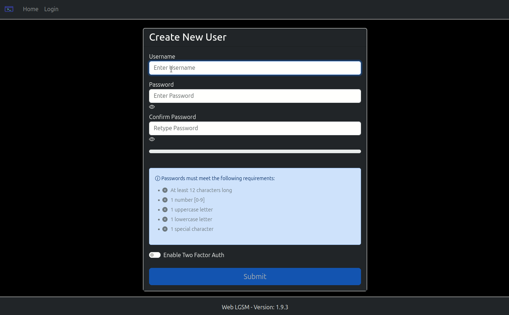 | 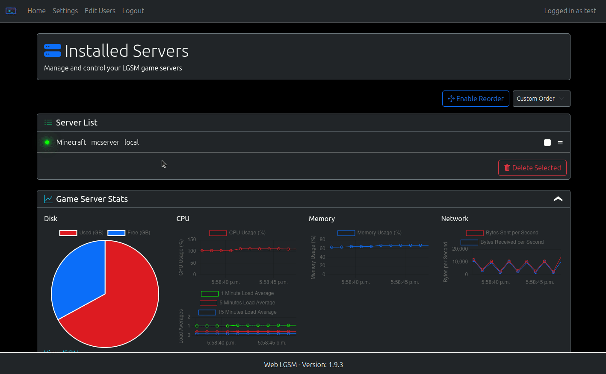 |

| Install Page | Add / Edit Servers |
|---------|-------------|
|  | 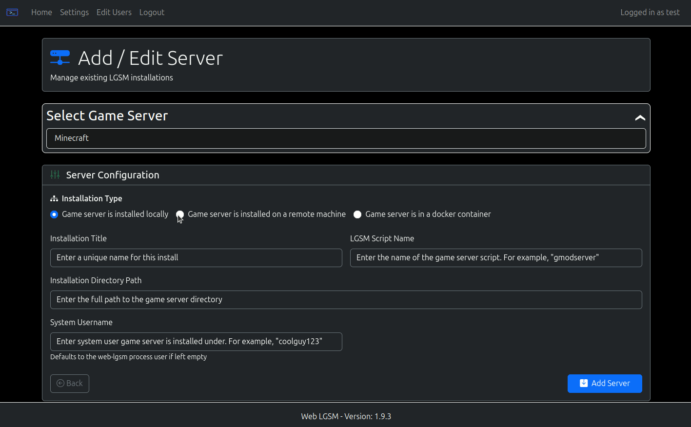 |

| Controls Page | File Manager |
|----------|-------------|
| 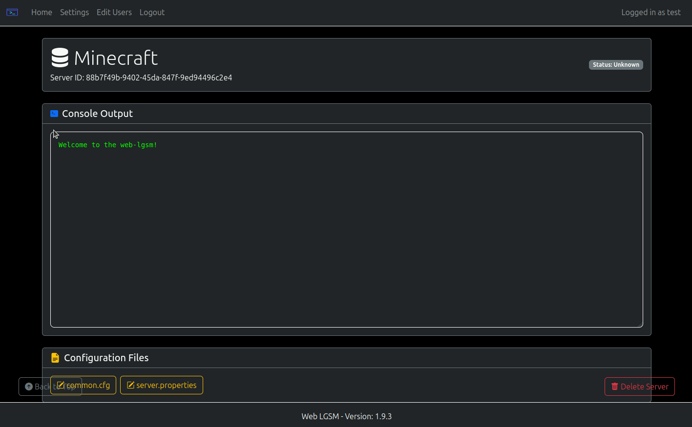 | 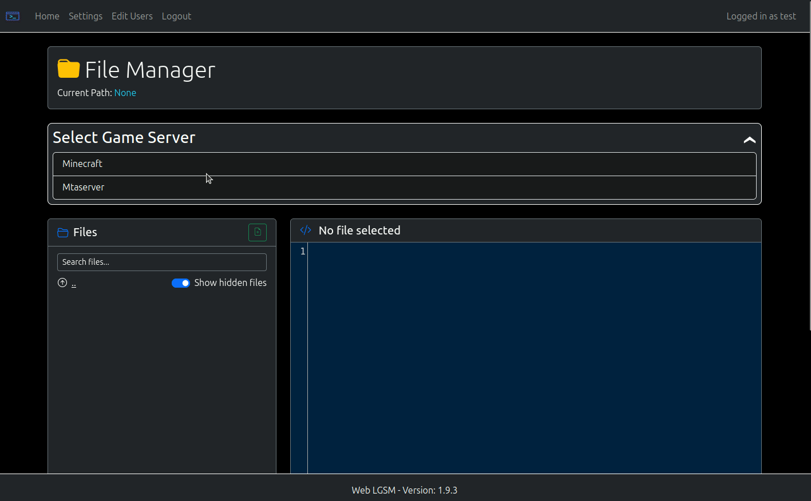 |

| Manage Jobs | Settings Page |
|----------|-------------|
| 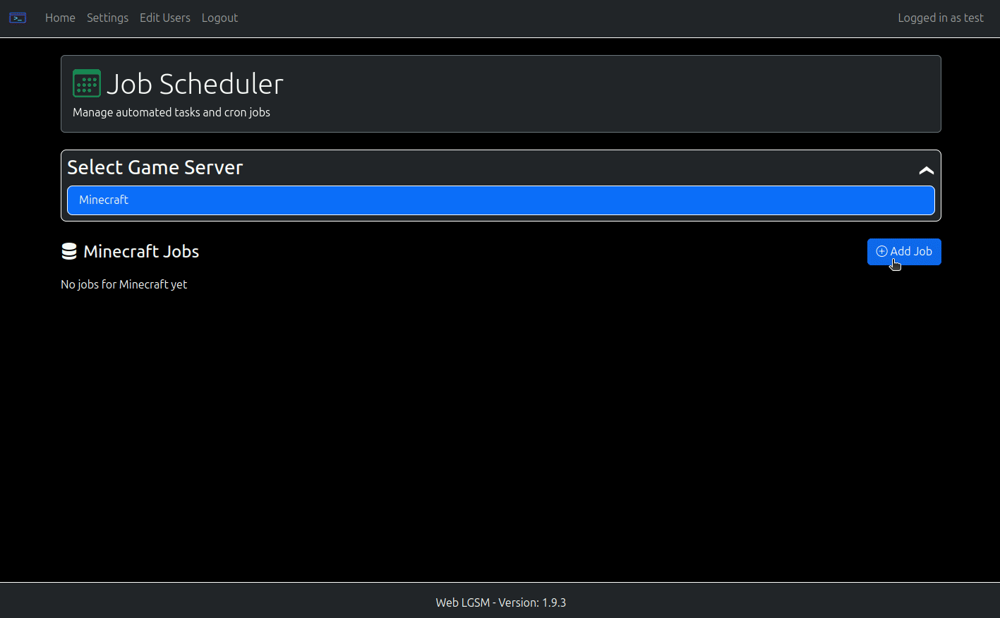 | 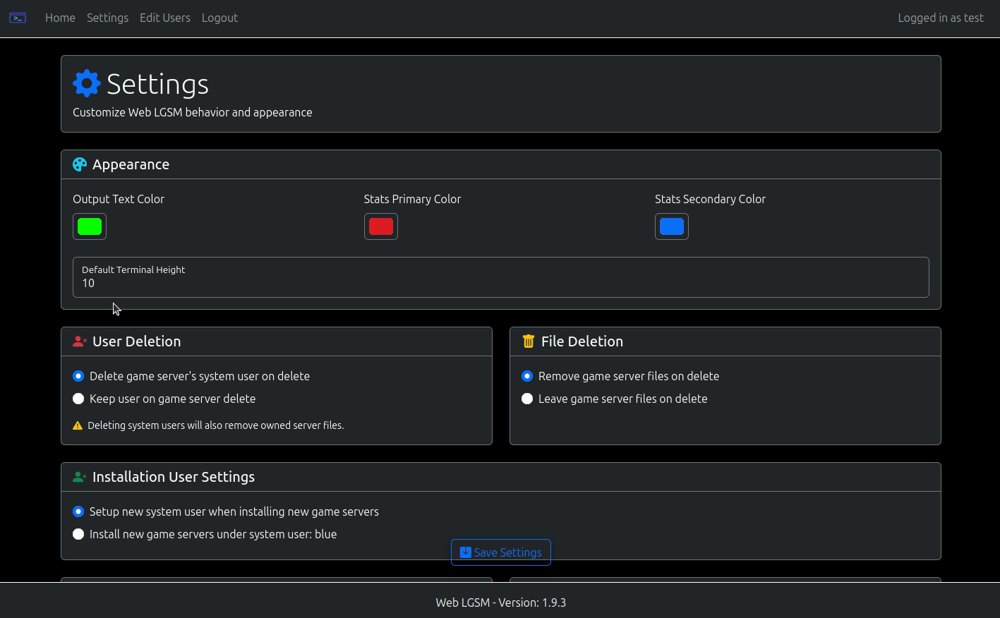 |

| Add Users | Audit Logs |
|----------|-------------|
| 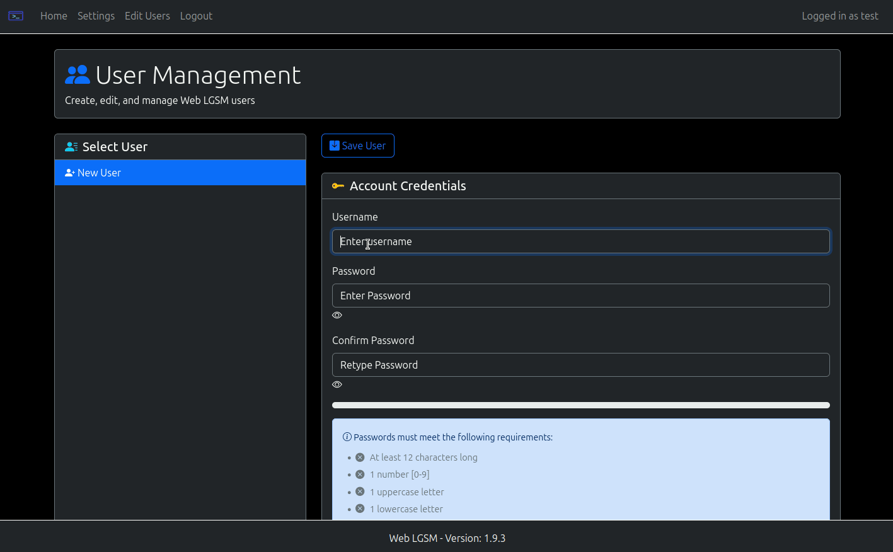 | 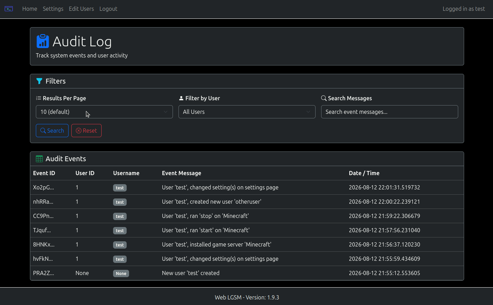 |

| About Page | Swagger Docs |
|----------|-------------|
| 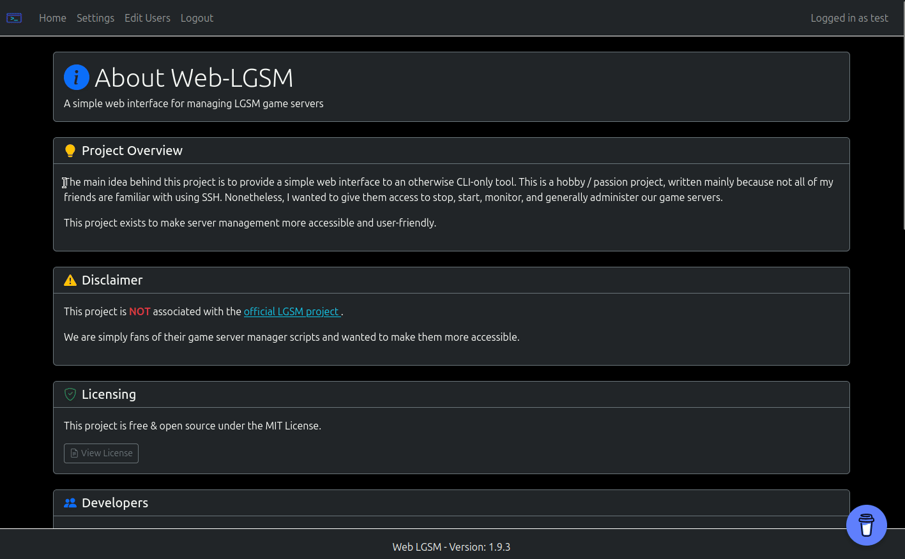 | 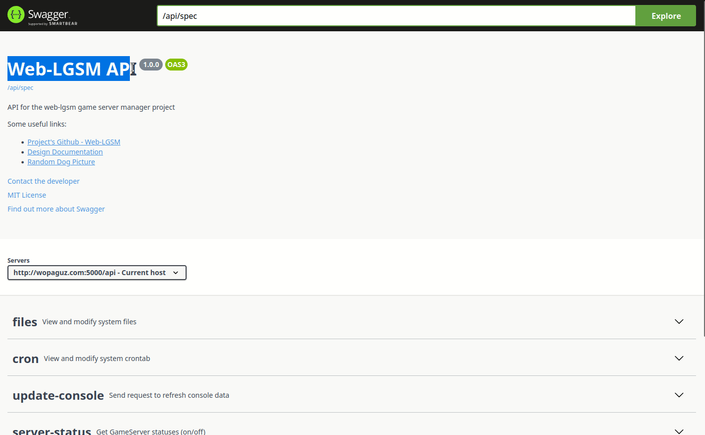 |

## Usage

Once logged in, the home page gives you access to all major features:

- **Install**: auto-install any LGSM-supported game server
- **Add**: import an existing LGSM installation
- **Controls**: start, stop, restart, and monitor a server; run LGSM commands with live output
- **File Manager**: edit server config files in-browser *(disabled by default; enable in `main.conf`)*
- **Job Editor**: edit server scheduled jobs in-browser *(disabled by default; enable in `main.conf`)*
- **Settings**: manage application preferences

## Deployment

If you're going to run the web-lgsm exposed on the public internet, the recommended approach is to:

1. Firewall the Web-LGSM port (default: `12357`) from public access
2. Proxy connections through a production web server such as **Apache** or **Nginx** with **SSL/TLS** enabled

See [`docs/suggested_deployment.md`](docs/suggested_deployment.md) for a full deployment guide.

## Stack

| Layer | Technology |
|-------|-----------|
| Language | [Python 3](https://www.python.org/) |
| Web Framework | [Flask](https://palletsprojects.com/p/flask/) |
| Database | [SQLite](https://www.sqlite.org/index.html) |
| ORM | [SQLAlchemy](https://www.sqlalchemy.org/) |
| CSS Framework | [Bootstrap 5](https://getbootstrap.com/) |
| JavaScript | [jQuery / Ajax](https://api.jquery.com/jQuery.ajax/) |
| Web Terminal | [Xterm.js](https://xtermjs.org/) |
| SSH Client | [Paramiko](https://www.paramiko.org/) |
| Testing | [Pytest](https://docs.pytest.org/) |
| Automation | [Ansible](https://www.ansible.com/) |
| Web Server | [Gunicorn](https://gunicorn.org/) |

## Contributing

> [!NOTE]
> We're actively seeking contributors! See the [CONTRIBUTING.md](docs/CONTRIBUTING.md) for more information.

Bug reports, security disclosures, and pull requests are all welcome.

- **Bugs & issues:** [GitHub Issues](https://github.com/BlueSquare23/web-lgsm/issues/new)
- **Contact:** [johnlradford.io/contact](https://johnlradford.io/contact.php)
- **Pull requests:** open against the latest `dev-x.y.z` branch

## Security

All user input is validated server-side before any system interaction. No raw user input reaches the shell.

That said, this project is actively developed and maintained by one person right now ([me](https://johnlradford.io/)). If you discover a vulnerability, please report it via the [issues page](https://github.com/BlueSquare23/web-lgsm/issues/new) or the [contact form](https://johnlradford.io/contact.php) rather than disclosing it publicly. Security patches are prioritized.

For production deployments, always run behind a reverse proxy with TLS. See the [Deployment](#deployment) section above.

## License

MIT: See [license.txt](license.txt) for full terms.

## Social

- [Discord](https://discord.gg/4rv7zSHcr)
- [YouTube](https://www.youtube.com/@web-lgsm)

## Contributors

<p align="center">
  <a href="https://github.com/BlueSquare23/web-lgsm/graphs/contributors">
    
  </a>
</p>

<p align="center">
  <sub>Built and maintained by <a href="https://github.com/BlueSquare23">@BlueSquare23</a>. Your face could be here next... See <a href="docs/CONTRIBUTING.md">CONTRIBUTING.md</a>.</sub>
</p>

## Support

[](https://www.buymeacoffee.com/bluesquare23)

[](https://patreon.com/web_lgsm?utm_medium=unknown&utm_source=join_link&utm_campaign=creatorshare_creator&utm_content=copyLink)
