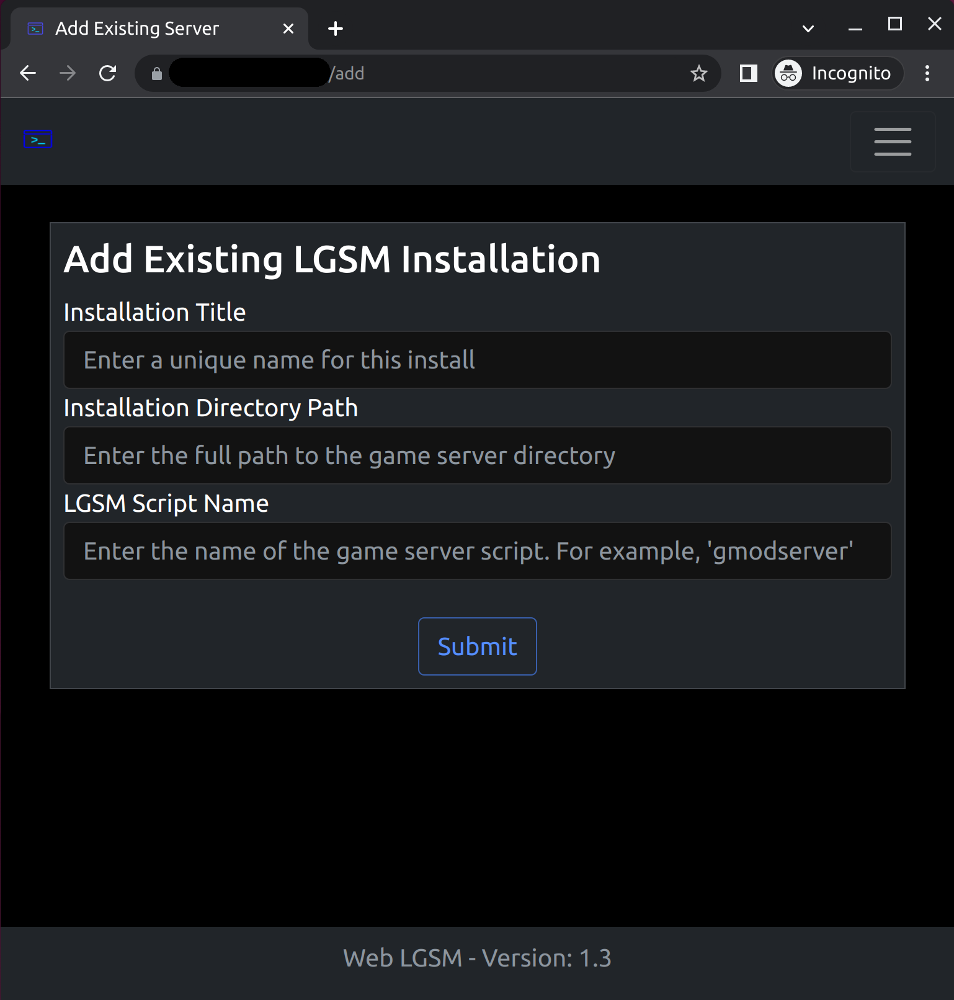

# Web LGSM

## Main Idea :thought_balloon:

This project is intended to be an easy to use web interface for the [Linux Game
Server Manager (LGSM)](https://linuxgsm.com/) command line tool. The LGSM is a
fantastic tool for installing and administering game servers via the CLI.
However, some users would rather manage their game server through a web
interface. That is what this project attempts to be.

## Installation :arrow_double_down:

* First clone this repo:

```
git clone https://github.com/BlueSquare23/web-lgsm.git
```

* Then cd down into the installation directory and run the `install.sh` script.

```
cd web-lgsm
./install.sh
```

* Once the install completes, start the server using the `init.sh` script.

```
./init.sh
```

* You can also stop the server with the `init.sh` script.

```
./init.sh kill
```

### Setup & Basic Usage :wrench:

After starting the server you can browse to the web address in a browser to
visit the web-lgsm `Setup` page.


After creating a user, you'll be automatically logged in and redirected to the
home page.


From the home page you can do several things!

You can auto install a new LGSM server from their entire list of available game
servers.


If you already have an LGSM game installed and setup your machine and you just
want to add it to the Web-LGSM interface you can do so by clicking the "Add an
Existing LGSM Installation" option.



Once you have a server added or installed you can access its `controls` page by
clicking on the link for it under the "Installed Servers" list on the home
page.

The console menu includes most of the common LGSM script commands, besides the
ones that require additional user input.


The console page also includes a **live** output feed from the command being
executed in a python subprocess shell on the system.


There's a basic app settings page.


And if you log out or are logged out, there's also a basic login page.


## A Note on Deployment Security :bangbang:

If you're going to run the Web-LGSM exposed to the public internet you should
firewall off the port for this app (defaults to 12357) and proxy connections to
this app through a **real** web server such as Apache or Nginx with SSL
encryption!

More information about that coming soon in the docs folder.

## Stack Technologies :books:

* Language: [Python 3](https://www.python.org/)
* Web Framework: [Flask](https://palletsprojects.com/p/flask/)
* Database: [SQLite](https://www.sqlite.org/index.html)
* ORM: [SQLAlchemy](https://www.sqlalchemy.org/)
* CSS Framework: [Bootstrap 5](https://getbootstrap.com/docs/5.0/getting-started/introduction/)
* Testing: [Pytest](https://docs.pytest.org/)
* Web Server: [Gunicorn](https://gunicorn.org/)

## Bugs :bug:

I want to try to keep up with this as a pet project so feel free to report any
bugs or security issues to me at <info@bluesquare23.sh>. Or if you're
interested in contributing to the project feel free to submit a pull request!

## Security & Liability :closed_lock_with_key:

I claim no liability for any injury or damages that may result from the use or
abuse of this piece of software. Use at your own risk! I have tried to take
security precautions when building this app in order to prevent it from being
horribly abused.

However, please note I am an amateur programmer and this app is fundamentally
sorta suss. It is a web portal for wrapping shell commands. Everything should
be validated, and no user input should be getting down to the shell.
Nonetheless, there are lots of hackers out there with a better knowledge of
application security than me and I make no claims that this is 100% unhackable.

I will try to patch any security vulnerabilities I find as time goes on. If you
find any and want to help feel free to submit them!

## License MIT :free:

[](https://opensource.org/licenses/MIT)

[MIT License Text](license.txt)

## Author

John L. Radford (Aka [BlueSquare23](https://johnlradford.io/))
