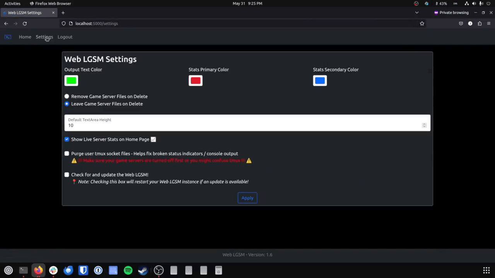

<h1 align="center">Web LGSM</h1>

<h3 align="center">🐧 A simple web interface for the <a href="https://linuxgsm.com/">LGSM</a>! 🕹️ </h3>

</p>

<p align="center">
  <a href="./license.txt">
    
  </a>
  
  <a href="https://github.com/BlueSquare23/web-lgsm/stargazers">
    
  </a>
  <a href="https://github.com/BlueSquare23/web-lgsm/network">
    
  </a>
</p>


## :thought_balloon: Main Idea

This project is intended to be an easy to use web interface for the [Linux Game
Server Manager (LGSM)](https://linuxgsm.com/) command line tool. The LGSM is a
fantastic tool for installing and administering game servers via the CLI.
However, some users would rather manage their game server through a web
interface. That is what this project attempts to be.

> :round_pushpin: _<span style="color: orange;">Note</span>: The web-lgsm is a
> fan project, and <span style="color: red;">**NOT**</span> affiliated in any
> way with the official [LSGM Project](https://linuxgsm.com/)_


## :arrow_double_down: Installation (Debian & Ubuntu Only)

* First `SSH` to the server where you're running the LGSM and clone this repo
  as your user (NOT root):

```
git clone https://github.com/BlueSquare23/web-lgsm.git
```

* Then cd down into the installation directory and run the `install.sh` script.

```
cd web-lgsm
./install.sh
```

* Once the install completes, start the server using the `init.sh` script.

```
./init.sh
```

* You can also stop the server with the `init.sh` script.

```
./init.sh stop
```

> :round_pushpin: _<span style="color: orange;">Note:</span> At this point the
> `install.sh` script only supports Debian & Ubuntu Linux. However, technically
> all the project needs to run is python3.7 or greater and some common shell
> utilites._
> 
> _If you're able to install the required dependacnies through your
> distributions package manager and install the required python modules then
> you should be able to run this on basically any flavor of Linux that is
> supported by the base LGSM project._


### :film_strip: Installation Setup & Overview Video Tutorial

Check out the YouTube video tutorial linked below for information about
installation, setup, and usage!

[](https://www.youtube.com/watch?v=aK_NsJIyIvk)


### :wrench: Setup & Basic Usage

#### Setup Page

After starting the server you can browse to the web address in a browser and
you'll be directed to the  web-lgsm `Setup` page, where you can create a user.


#### Home Page

After creating a user, you'll be automatically logged in and redirected to the
home page.

[:framed_picture: Home Page Image](docs/images/home_page.png)

From the home page you can do several things!

#### Install Page

You can auto install a new LGSM server from their entire list of available game
servers.


Once the installation process is started a set of spinners and an installing...
message will appear above the live running console output of the ongoing
installation.

#### Add Page

If you already have an LGSM game server installed and setup on your machine and
you want to add it to the Web-LGSM interface you can do so by clicking the "Add
an Existing LGSM Installation" option.


#### Controls Page

Once you have a server added or installed you can access its `controls` page by
clicking on the link for it under the "Installed Servers" list on the home
page.

The console menu includes most of the common LGSM script commands, besides the
ones that require additional user input.

[:framed_picture: Controls Page Image](docs/images/server_controls.png)

#### Running a Command

The console page also includes a **live** output feed from the command being
executed in a python subprocess shell on the system.


#### Config Editor

You can click one of the edit config buttons on a given game server's controls
page to access the config editor. From the config editor you can change any of
the necessary game server settings and save them. You can also download a copy
of the config file.

[:framed_picture: Editing A Game Server Config Page Image](docs/images/config_editor.png)

> :round_pushpin: _<span style="color: orange;">Note</span>: the config editor
> is disabled by default and can only be enabled by editing the `main.conf`
> file directly._

#### Settings Page

There's a basic app settings page.



#### Login Page

And if you log out or are logged out, there's also a basic login page.

[:framed_picture: Login Page Image](docs/images/login.png)


## :bangbang: A Note on Deployment Security

If you're going to run the Web-LGSM exposed to the public internet you should
firewall off the port for this app (defaults to 12357) and proxy connections to
this app through a **real** web server such as Apache or Nginx with SSL
encryption!

More information about that coming soon in the docs folder.


## :books: Stack Technologies

* Language: [Python 3](https://www.python.org/)
* Web Framework: [Flask](https://palletsprojects.com/p/flask/)
* Database: [SQLite](https://www.sqlite.org/index.html)
* ORM: [SQLAlchemy](https://www.sqlalchemy.org/)
* CSS Framework: [Bootstrap 5](https://getbootstrap.com/docs/5.0/getting-started/introduction/)
* Testing: [Pytest](https://docs.pytest.org/)
* Web Server: [Gunicorn](https://gunicorn.org/)


## :bug: Bugs

I want to try to keep up with this as a pet project so feel free to report any
bugs or security issues to me via [this project's github issues page](https://github.com/BlueSquare23/web-lgsm/issues/new) 
or [my site's contact form](https://johnlradford.io/contact.php).  Or if you're interested in
contributing to the project feel free to submit a pull request!


## :closed_lock_with_key: Security & Liability

I claim no liability for any injury or damages that may result from the use or
abuse of this piece of software. Use at your own risk! I have tried to take
security precautions when building this app in order to prevent it from being
horribly abused.

However, please note I am an amateur programmer and this app is fundamentally
sorta suss. It is a web portal for wrapping shell commands. Everything should
be validated, and no user input should be getting down to the shell.
Nonetheless, there are lots of hackers out there with a better knowledge of
application security than me and I make no claims that this is 100% unhackable.

I will try to patch any security vulnerabilities I find as time goes on. If you
find any and want to help feel free to submit them!


## :free: License MIT

[MIT License Text](license.txt)


## :writing_hand: Author

[John L. Radford](https://johnlradford.io/)

[](https://www.buymeacoffee.com/bluesquare23)
