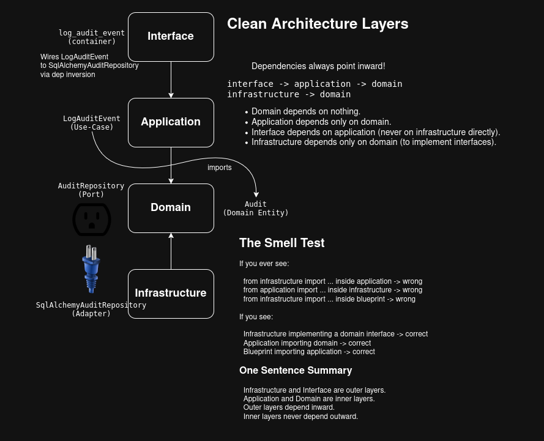

# Software Architecture

## Overview

The word _"Architecture"_ is overloaded. This document discusses the web-lgsm's
_Software Architecture_ (aka code organization, boundaries, and flow of control
inside the application). It does **NOT** cover _System Architecture_ (aka
specific technologies used and why). For more info about _System Architecture_ 
see the [DESIGN.md](DESIGN.md) file.

## Good-Ole MVC

The basic three tier Model, View, Controller (MVC) arch is a good starting
point for understanding this applications architecture. For a long time MVC is
all that we really used and it still serve as a good point of reference for
breaking things down.


Under MVC, we split the application up into three distinct components, each
with different responsibilities.

* Model: Data layer of application (concrete example: The ORM class that defines our tables schema)
* View: Presentation layer, UI components, Display of data from model (concrete example: The template for the page that presents info and interface to controller (ie. forms))
* Controller: Interface between View & Model. Translates user input to changes to Model and correspondingly updates View to reflect changes. (concrete example: Route code that handles POST requests and does needful)

However, the truth is this application has more complexity than can be
described by MVC alone. In reality, the classic MVC layers become relegated to
the outer most rim of our Architecture Onion with our core domain logic being
defined by The Clean Architecture.

## Clean Architecture

This app uses [_The Clean Architecture_](https://blog.cleancoder.com/uncle-bob/2012/08/13/the-clean-architecture.html)
(mostly). Its another one from Uncle Bob. 


The Clean Architecture is all about dependency direction and separation of
concerns.

We want to structure our code so that the core business problem we're solving
is independent from the specific web framework or DB, etc. being used to solve
it. In sort its about what each layer of our code is doing.

### The Layers

We're using a basic Clean Architecture with 4 layers:

```
┌──────────────────────────────┐
│        Interface Layer       │  (Flask, blueprints, forms)
├──────────────────────────────┤
│       Application Layer      │  (Use cases)
├──────────────────────────────┤
│          Domain Layer        │  (Entities + interfaces)
├──────────────────────────────┤
│       Infrastructure Layer   │  (DB, filesystem, tmux, OS, etc)
└──────────────────────────────┘
```

#### Separation of Concerns / Dependency Graph

```
  Interface (aka Routes, Forms, Templates, etc)
          |
          v
  Use Cases (Application)
          |
          v
  Entities (Domain)
          ^
          |
  Infrastructure (DB, CMDs, filesystem, tmux, OS, etc)
```

#### The Only Rule That Matters

> Dependencies always point inward.

```
interface -> application -> domain
infrastructure -> domain
```

* Domain depends on nothing.

* Application depends only on domain.

* Interface depends on application (never on infrastructure directly).

* Infrastructure depends only on domain (to implement interfaces).



#### A Basic Example

This py-Ohio talk gives a nice summation.

[The Clean Architecture](https://youtu.be/DJtef410XaM)

Main idea is:

* IO (DB calls, requests, web stuff) should be the outer most ring around a

> "Imperative shell" that wraps and uses your "Functional Core"

So the inner most modules shouldn't "do" anything. They just take in one data
structure and spit out another data structure.

Its sort of an inversion of the typical paradigm where methods abstract away
complexity and handle the messy business for you. Instead under this model,
methods simply take data structures and return data structures and on the outer
most layer is where the actual imperative "do" logic happens.

Example:

```python
# Outer Imperative Shell
def find_definition(word):
    url = build_url(word)
    data = requests.get(url).json()  # I/O
    return pluck_definition(data)

# Inner Functional Core
def build_url(word):
    q = 'define' + word
    url = 'http://api.duckduckgo.com/?'
    url += urlencode({'q': q, 'format': 'json'})

def pluck_definition(data):
    definition = data[u'Definition']
    if definition == u'':
        raise ValueError('that is not a word')
    return definition
```

Procedure Diagram:

```
↘
  Proceedure
             ↘ 
               pure function
             ↘ 
               pure function
```

So now we can test our `build_url` and `pluck_definitions` functions without
having to actually "do" anything, change any external state, etc. We just pass
data in and confirm it comes back out again correctly.

## Layers & Design Patterns

We'll start at the top / outside and work our way down / in.

### The Flask App Factory

* [`app/__init__.py`](app/__init__.py)

Everyone who's ever written a flask app before is probably familiar with the
main `create_app` factory. Where this app differs is the main `app/__init__.py`
file is really mostly concerned with interface layer concerns (blueprints,
flask extensions, headers). Its still doing some composition root stuff (eg
logging) for "historic" reasons. But for the most part its pretty boiler plate,
just produces a flask `app` object.

### The container.py - Composition Root

* [`app/container.py`](app/container.py)

The composition root is really the key concept here. It's the one place in the
entire application that's allowed to know about everything; all the concrete
implementations, all the repositories, all the wiring. It's dirty by design so
everything else can stay clean. Think of it as the place where all the
abstraction debt gets paid. For these same reasons it is very plain and large.

We use the container.py to dependency invert our repositories and system
interfaces for use in our application use cases. **Remember, under a clean
architecture our application layer cannot directly depend on our infrastructure
layer!** So in order for our use cases in our application layer to actually do
anything with those infrastructure layer classes, they need to be handed them
via dep inversion.

That way when we go to call our application use cases via the container in the
interface layer (aka route code), they'll have the repositories or other infra
layer stuff they need.

### The Interface Usecase Factory Module

* [`app/interface/use_cases/__init__.py`](app/interface/use_cases/__init__.py)

In our interface layer, we want to use the container to have access to our
application use cases. That's how the app works. If we want to do something
beside just flask HTTP stuff, we need to call a use case via our container.

This introduces a qol problem though as each usecase call via the container is
long and messy like this:

```python
servers = container.list_user_game_servers().execute(current_user.id)
```

And if we left those long calls all throughout the route code, it'd be
unsightly. So instead this cleaver little bit of code transforms our long
container usecase calls into much shorter and more readable calls like this:

```python
servers = list_user_game_servers(current_user.id)
```

### Use Case Pattern

Our application use cases all follow the same basic structure that looks like this:

* Example Usecase: [`app/application/use_cases/game_server/list_game_servers.py`](app/application/use_cases/game_server/list_game_servers.py)

```python
class ListGameServers:

    def __init__(self, game_server_repository):
        self.game_server_repository = game_server_repository

    def execute(self):
        return self.game_server_repository.list()
```

As mentioned previously, they get imported in the container and given access to
infrastructure repos and services via dep inversion and are called in the
interface layer.

### The Repository Pattern

Anything that access the database, the file system, or process info objects for
running processes, utilizes the repository pattern.

The repository pattern helps to decouple highly interdependent code by
introducing a separation between the way(s) we store data and the operations we
preform on that data. It make code more testable, makes responsibilities more
singular, and to paraphrase uncle Bob; _makes concrete implementations (ie. DBs,
ORM, File Storage) dependant on abstractions (ie Data Classes & Abstract Base
Classes)_.

In practice in our app the repository looks like this. 

First off in our domain layer we have:

* A Domain Entity: [`app/domain/entities/game_server.py`](app/domain/entities/game_server.py)

```python
class GameServer:
    """
    Abstract domain layer representation of a GameServer.
    """
    ...
```

* An Interface Adapter: [`app/domain/repositories/game_server_repo.py`](app/domain/repositories/game_server_repo.py)

```python
class GameServerRepository:

    def add(self, game_server):
        raise NotImplementedError

    def update(self, game_server):
        raise NotImplementedError
    ...
```

We then inherit from that abstract Repository class in our infrastructure
layer.

* Concrete Infrastructure Port: [`app/infrastructure/persistence/repositories/game_server_repo.py`](app/infrastructure/persistence/repositories/game_server_repo.py)

```python
import os
import uuid
import json
import base64
import onetimepass

from app.domain.repositories.game_server_repo import GameServerRepository
from app.domain.entities.game_server import GameServer
from app.infrastructure.persistence.models.game_server_model import GameServerModel
from app import db

class SqlAlchemyGameServerRepository(GameServerRepository):

    def add(self, game_server):
        if not game_server.id:
            game_server.id = str(uuid.uuid4())

        model = GameServerModel(
            id = game_server.id,
            install_name = game_server.install_name,
            install_path = game_server.install_path,
            ...
```

And lastly our actual SqlAlchemy ORM classes are also defined in our
infrastructure layer.

* DB Model: [`app/infrastructure/persistence/models/game_server_model.py`](app/infrastructure/persistence/models/game_server_model.py)

```python
import uuid

from app import db

class GameServerModel(db.Model):
    # Use UUIDs for game server IDs.
    id = db.Column(
        db.String(36),
        primary_key=True,
        default=lambda: str(uuid.uuid4()),
        unique=True,  # Ensure uniqueness
        nullable=False,  # Ensure not null
    )
    # Name.
    install_name = db.Column(db.String(150))
    # Install path.
    install_path = db.Column(db.String(150))

```

This way when we go to access our data via an application use case, nothing is
tightly coupled with the database allowing for clean separation of concerns.
Our route code doesn't have to know about the specific database we're using.

While we're primarily using the repository pattern for database stuff, its not
limited to databases by any means. You can use it anytime you need to isolate
the way data is stored from the actions you take on that data. So for example
we're also using repositories to keep track of a pool of in memory process info
objects as well as an in memory dictionary of login failed IPs.


