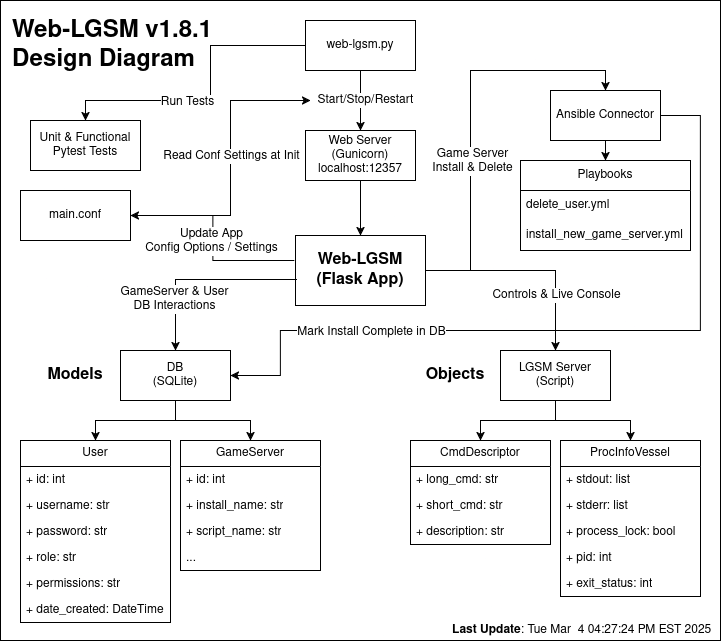
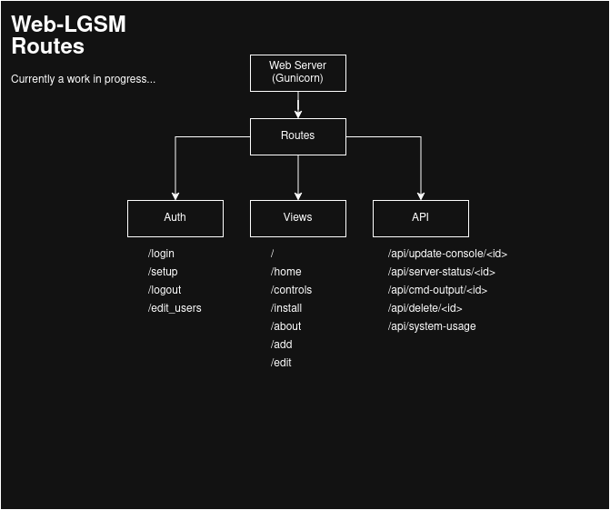
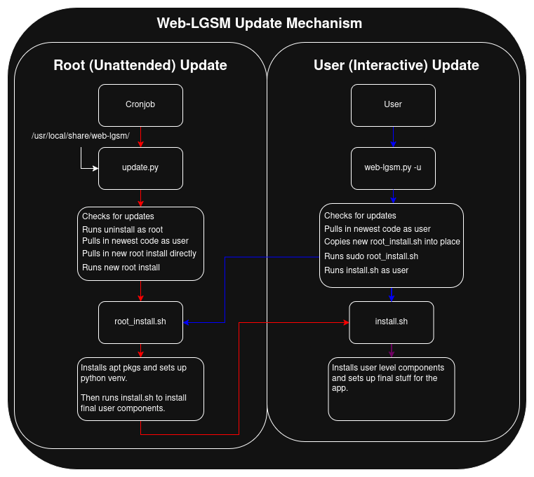

# Design Document: Web-LGSM

## 1. Introduction
- **Purpose**: The Web-LGSM is a simple web interface for managing LGSM game servers.
- **Scope**: This document covers the high-level architecture and specific components of the web-lgsm.
- **Audience**: This document is intended for developers, contributors, and maintainers. However, general users may find it interesting as well.

### Table of Contents

1. [Introduction](#1-introduction)
2. [Overview](#2-overview)
3. [Architecture](#3-architecture)
4. [Detailed Design](#4-detailed-design)
5. [Design Decisions](#5-design-decisions)
6. [API Documentation](#6-api-documentation)
7. [Configuration](#7-configuration)
8. [Deployment](#8-deployment)
9. [Testing](#9-testing)
10. [Automatic Updates](#10-automatic-updates)
11. [Database Upgrades](#11-database-upgrades)
12. [Form Handling & Validation](#12-form-handling--validation)
13. [Formatting & Linting](#13-formatting--linting)
14. [Future Work](#14-future-work)
15. [Contributing](#15-contributing)
16. [References](#16-references)

---

## 2. Overview
- **Project Goals**: The goal of this project is to provide an easy to install, maintain, and use web interface for managing LGSM game servers (optionally within containers) on a single machine or across multiple servers.
- **Technology Stack/Dependencies**:
  * Language: [Python 3](https://www.python.org/)
  * Web Framework: [Flask](https://palletsprojects.com/p/flask/)
  * Database: [SQLite](https://www.sqlite.org/index.html)
  * ORM: [SQLAlchemy](https://www.sqlalchemy.org/)
  * CSS Framework: [Bootstrap 5](https://getbootstrap.com/docs/5.0/getting-started/introduction/)
  * JavaScript: [jQuery ajax](https://api.jquery.com/jQuery.ajax/)
  * Web Terminal: [Xterm.js](https://xtermjs.org/)
  * SSH Client [Paramiko](https://www.paramiko.org/)
  * Testing: [Pytest](https://docs.pytest.org/)
  * Automation: [Ansible](https://www.ansible.com/)
  * Web Server: [Gunicorn](https://gunicorn.org/)
  * DB Migrations: [Flask-Migrate](https://flask-migrate.readthedocs.io/en/latest/)
  * Form Handling: [Flask-WTF](https://flask-wtf.readthedocs.io/en/1.2.x/)
  * Logging: [Flask Logging](https://flask.palletsprojects.com/en/stable/logging/)

---

## 3. Architecture
- **High-Level Diagram**:



- **Components**:
  * `web-lgsm.py`: Main project init script. Takes care of starting, stopping, restarting the main gunicorn server. But can also be used to run pytests, updating the app, changing passwords, and more. Main point of entry script for the project.
  * `Flask App`: The main flask application. Basic MVC architecture. Game server and user info is stored in the SQLite db, config options in main.conf. Utilized external ansible connector for game server install & delete.
  * `Ansible Connector`: Middleware script for running ansible playbooks (for game server install & delete) with elevated privileges. Playbooks set up new system user, sets up ssh to new user, & installs game server.
  * `Models`: DB models used to store info about users and connected game server installs. I'm using Flask's SQLAlchemy ORM to interact with the database.
  * `Objects`: As of right now, this app is not very OOP. Mainly I'm just using one `ProcInfoVessel` class to create objects for storing output from commands. I'd like to make this app more object oriented in the future, but everything takes time.
  * `main.conf`: The main configuration file for storing settings relating to aesthetic & control features for the flask app. The settings page updates this file directly.

---

## 4. Detailed Design
- **Routes/Endpoints**:

  * Auth Routes
    - `/login`: Handles authentication to web portal, can't access any other pages until logged in.
    - `/setup`: Web-lgsm setup page, becomes inaccessible after initial user creation.
    - `/logout`: Handles logging users out of web interface.
    - `/edit_users`: Handles creating, modifying, & deleting additional web interface users.
  * Views
    - `/`: Alias for home page.
    - `/home`: Application home page index, contains links to game servers and live web-lgsm system cpu, mem, disk, net stats view.
    - `/controls`: Controls page for individual game servers. Holds start,stop,restart,etc. buttons, live console, and links to config editor.
    - `/install`: Install new game servers page. Contains a list of available LGSM game server titles that can be installed with the click of a button!
    - `/settings`: Main settings page for application settings. Settings are stored in and map to values in the `main.conf` file. See `docs/config_options.md` for full list of config options.
    - `/about`: Basic about and credits page, nothing fancy.
    - `/add`: Page for adding additional already installed LGSM instances to the web interface. Can add locally installed game servers, game servers installed on remote servers, and game servers installed within docker containers.
    - `/edit`: Game server config file editor page. If enabled, allows users to edit specific game server files through the web interface.
  * API:
    - `/api/delete`: API route for handling game server delete requests. 
    - `/api/update-console`: Handles running the underlying cmd for dumping tmux session live console output and returning it as a json object. (this is a hack and is bad!)
    - `/api/server-status`: Handles returning live server status json used by home page cpu, mem, disk, net charts.
    - `/api/cmd-output`: Handles running cmds and returning json output for all non-live console output cmds. (live console is weird, needs it own route)

- **Models**: The Flask SqlAlchemy Models for this project are very simple:
  * User: Model for holding user information. Permission, Username, Pass Hash, etc.
  * GameServer: Model for information about individual game servers. Install Path, Name, Install Type, Install Host, etc.

- **Basic App Structure**:
```
app/
├── api.py                  # Houses all API logic.
├── auth.py                 # Houses setup, login, & add/edit user pages.
├── cmd_descriptor.py       # Houses CmdDescriptor class for creating command description objects.
├── database.db             # Sqlite DB file for project.
├── forms.py                # Houses Flask-WTF form classes for form handling & validation.
├── __init__.py             # Main entrypoint for app. Set's up app, db, imports route blueprints, etc.
├── models.py               # Houses main Flask SqlAlchemy db classes.
├── processes_global.py     # Houses global singleton dict of ProcInfoVessel objects.
├── proc_info_vessel.py     # Houses ProcInfoVessel class for creating proc_info objects.
├── specs
│   └── api_spec.yaml       # Swagger API Docs yaml spec sheet, used for building interactive swagger docs.
├── static
│   ├── css
│   │   └── main.css        # For custom non-bootstrap CSS.
│   ├── img
│   │   ├── ...
│   │   └── favicon.ico     
│   └── js                  # Javascript dir for vanilla & Jquery scripts.
│       ├── node_modules    
│       │   └── @xterm      # Npm Xterm.js library for web terminal.
│       │       └── ...
│       ├── ...
│       └── update-xterm.js
├── templates               # Houses Jinja2/HTML templates for app's pages.
│   ├── about.html
│   ├── add.html
│   ├── base.html
│   └── ...
├── utils.py            # Houses all the shit I didn't have a better place for.
└── views.py            # Houses main views blueprints for the app. Aka home, add, edit, settings, etc. pages.

```

---

## 5. Design Decisions
- **Primary Motivator**: Make it work! This project has NOT been well designed.
  Trying now to do a better job at design now, hence this doc. But many aspects
  of this project have just been assembled until they work. So if you see
  something dumb, and think "why is that stupid" answer likely is because I
  didn't know any better or was too lazy at the time.

- **Why Ansible Connector**: This app needed the ability to create and destroy
  new system users, setup directories and permissions for them, etc. So lots of
  sort of system administrative tasks. I don't want to re-invent the wheel so
  just went with ansible. Problem is, playbooks for this app need to run as root
  without a pass. Rather than creating a mess of sudoers rules, I decided on a
  single external script (aka the `ansible_connector.py`) for being the interface
  between the project's playbooks and the running flask app itself.

- **More Stuff**: Fill me out with even more considerations that came up while
  building this app. Will add more stuff later, cause yeah there's more I
  should prolly esplain. For now, see the faqs if you have questions.

---

## 6. API Documentation
- Builtin Swagger documentation under `https://your_web_lgsm_url/docs`.


---

## 7. Configuration
- **main.conf**: For more info about main.conf variables see [`config_options.md`](config_options.md)

---

## 8. Deployment
- **Deployment Process**: For more information about sugested deployment for this app see [`suggested_deployment.md`](suggested_deployment.md)
- **CI/CD**: Continuous Integration for this project is handled by Github Actions runners. 
  - These runs are triggered by the [`.github/workflows/test.yml`](../.github/workflows/test.yml)

---

## 9. Testing
- **Testing Strategy**: Practical > Coverage

This project is tested using `pytest`.

The main goal of this projects tests are practically test if shit is working or
not. I have not put a big focus on code coverage. Toward this end you'll find
that the bulk of the tests are functional, input output response test of how the
app's routes behave with scant unit tests.

We're now trying to use the _"Arrange-Act-Assert (AAA)"_ Pattern when creating
the tests. Below cribbed directly from automationpanda.com.

The Pattern

Arrange-Act-Assert is a great way to structure test cases. It prescribes an
order of operations:

* Arrange inputs and targets. Arrange steps should set up the test case. Does
  the test require any objects or special settings? Does it need to prep a
  database? Does it need to log into a web app? Handle all of these operations
  at the start of the test.

* Act on the target behavior. Act steps should cover the main thing to be
  tested. This could be calling a function or method, calling a REST API, or
  interacting with a web page. Keep actions focused on the target behavior.

* Assert expected outcomes. Act steps should elicit some sort of response.
  Assert steps verify the goodness or badness of that response. Sometimes,
  assertions are as simple as checking numeric or string values. Other times,
  they may require checking multiple facets of a system. Assertions will
  ultimately determine if the test passes or fails.

[Arrange-Act-Assert (AAA) Pattern Explained](https://automationpanda.com/2020/07/07/arrange-act-assert-a-pattern-for-writing-good-tests/)

### Tests Components & Structure

Here's the basic test dirs structure:

```
tests/
├── conftest.py
├── functional
│   ├── test_auth.py
│   ├── test_views.py
│   └── test_web-lgsm.py
├── game_servers.py
├── test_data
│   ├── common.cfg
│   └── Mockcraft
│       ├── linuxgsm.sh
│       └── mcserver
├── test_vars.json
└── unit
    ├── test_models.py
    └── test_utils.py
```

We have a few things going on here: 

* The `conftest.py` file. This is where the test setup and teardown happen.

* The `functional` holds our functional tests. These use the client and other
  pytest fixtures setup by the `conftest.py` to test the apps various routes
  and to test the `web-lgsm.py` itself.

* The `game_servers.py`: Loads some json from static file for tests (just a lil util).

* The `test_data` dir holds the fake _"Mockcraft"_ install (not a full game
  server install, just the bare files for mocking).

* The `test_vars.json` file holds some static data used for testing stuff. Why
  is this not in the apps json folder? `¯\_(ツ)_/¯`

* The `unit` dir holds the projects straight unit tests of utils functions and
  the apps models. These could really used expanded and made more through, but
  ya know time...

Basically, the `conftest.py` has a bunch of pytest fixture functions in it
that are used to do the setup & teardown (aka the Arrange step) for tests to
ensure _idempotency_ and _independence_. Then the actual `test_` files
themselves are where the Act and Assert steps come in.

* Independence: Meaning no test relies on any other test to work working.

* Idempotency: Meaning no test should leave artifacts that affect overall
  state. Everything should be setup fresh for each test and nothing should be
  left behind that affects another test.

Both of these things together mean that any one test should be able to be run
in isolation and be self contained, and its passing or failing should not
affect any other tests.

### Coverage

Code coverage reports generated with [`coverage`](https://coverage.readthedocs.io/en/7.8.0/).

* Run pytests with coverage:

```
» coverage run -m pytest -v
```

```
# Generated: Sat Apr 19 03:49:24 PM EDT 2025
» coverage report
Name                                Stmts   Miss  Cover
-------------------------------------------------------
app/__init__.py                        57      4    93%
app/api.py                            122     34    72%
app/auth.py                           195     20    90%
app/cmd_descriptor.py                   9      1    89%
app/models.py                          33      1    97%
app/proc_info_vessel.py                15      0   100%
app/processes_global.py                15      0   100%
app/utils.py                          746    250    66%
app/views.py                          532    132    75%
tests/conftest.py                     113     17    85%
tests/functional/test_auth.py         205      2    99%
tests/functional/test_views.py        681     15    98%
tests/functional/test_web-lgsm.py      29      0   100%
tests/game_servers.py                   5      0   100%
tests/unit/test_models.py              26      0   100%
tests/unit/test_utils.py              127      8    94%
-------------------------------------------------------
TOTAL                                2910    484    83%
```
---

## 10. Automatic Updates

Updates for the web-lgsm can be initiated either interactively by the user
running `./web-lgsm.py --update` or headlessly via a root crontab entry running
the `update.py` script.

[More info on enabling auto updates can be found here](how_to_enable_auto_updates.md).



The `update.py` script needs to be a root cronjob because its not possible to
install the apt packages and other system level components of this project
non-interactively, unless its running as root.

Obviously, this has security implication. To help remedy these, I've made it so
the code run as root is pulled in via hardcoded urls and installed directly,
rather than being pulled via user editable git origin urls.

## 11. Database Upgrades

- **Flask-Migrate (Aka Alembic)**: Alembic is a lightweight database migration
  tool for usage with the SQLAlchemy Database Toolkit for Python.

We're using the Flask version of Alembic called `Flask-Migrate`.

### Initial Setup

Documenting the initial setup here. Should only need done once but was tricky so
want to keep some notes. 

The key here is the application code itself is no longer handling creating and
updating stuff in the DB. So code like this has to go away:

```python
# BAD! NO LONGER USED!
    with app.app_context():
        db.create_all()
        print(" * Database Loaded!")
```
[Source](https://stackoverflow.com/a/19324130)

Instead, now its the flask-migrate extension directly handling changes to the
database, duh.

```python
# GOOD! New code for managing DB state via Flask-Migrate extension.
     migrate = Migrate(app, db, render_as_batch=True)
     db.init_app(app)
     migrate.init_app(app, db)
```

So in order to initialize Flask-Migrate for the first time we need to sorta
trick it. With a fresh empty database.db file, do the follow to setup
Flask-Migrate:

1. In `__init__.py` comment out the models import line and save the file.

```
# For init of flask-migrate we want an empty database so don't import models yet.
#    from .models import User, GameServer
```

2. Run the db init to setup database tracking:
```
» flask --app app:main db init
Root logger level: WARNING
  Creating directory '/home/blue/Projects/web-lgsm/migrations' ...  done
  Creating directory '/home/blue/Projects/web-lgsm/migrations/versions' ...  done
  Generating /home/blue/Projects/web-lgsm/migrations/README ...  done
  Generating /home/blue/Projects/web-lgsm/migrations/env.py ...  done
  Generating /home/blue/Projects/web-lgsm/migrations/alembic.ini ...  done
  Generating /home/blue/Projects/web-lgsm/migrations/script.py.mako ...  done
  Please edit configuration/connection/logging settings in '/home/blue/Projects/web-lgsm/migrations/alembic.ini' before proceeding.
```

3. Uncomment models import again so app is loading our db classes.
```
# Now we want flask migrate to import and see the models.
    from .models import User, GameServer
```

4. Run initial migrate:

```
» flask --app app:main db migrate -m "Initial migrate"
Root logger level: WARNING
INFO  [alembic.runtime.migration] Context impl SQLiteImpl.
INFO  [alembic.runtime.migration] Will assume non-transactional DDL.
INFO  [alembic.autogenerate.compare] Detected added table 'game_server'
INFO  [alembic.autogenerate.compare] Detected added table 'user'
  Generating /home/blue/Projects/web-lgsm/migrations/versions/83095689301a_initial_migrate.py ...  done
```

This will generate a migration script and we can see all of our models being
setup in there:

```python
def upgrade():
    # ### commands auto generated by Alembic - please adjust! ###
    op.create_table('game_server',
    sa.Column('id', sa.String(length=36), nullable=False),
    sa.Column('install_name', sa.String(length=150), nullable=True),
    sa.Column('install_path', sa.String(length=150), nullable=True),
...
```

5. Finally run the upgrade to bring the database schema up to date:
```
» flask --app app:main db upgrade
Root logger level: WARNING
INFO  [alembic.runtime.migration] Context impl SQLiteImpl.
INFO  [alembic.runtime.migration] Will assume non-transactional DDL.
INFO  [alembic.runtime.migration] Running upgrade  -> 83095689301a, Initial migrate
```

Check the pragma for the db and you should see its got our tables and they set:
```
» sqlite3 database.db '.mode table' 'PRAGMA table_info(user);'
+-----+--------------+--------------+---------+------------+----+
| cid |     name     |     type     | notnull | dflt_value | pk |
+-----+--------------+--------------+---------+------------+----+
| 0   | id           | INTEGER      | 1       |            | 1  |
| 1   | username     | VARCHAR(150) | 0       |            | 0  |
| 2   | password     | VARCHAR(150) | 0       |            | 0  |
| 3   | role         | VARCHAR(150) | 0       |            | 0  |
| 4   | permissions  | VARCHAR(600) | 0       |            | 0  |
| 5   | date_created | DATETIME     | 0       |            | 0  |
| 6   | img_path     | VARCHAR(150) | 0       |            | 0  |
+-----+--------------+--------------+---------+------------+----+
```

### Adding a New Database Field

* Add a new field to a `models.py` file.

```
img_path = db.Column(db.String(150))  # New field
```

* Create a new migration: This will generate a new file in `migrations/versions/` for this change.

```
flask --app app:main db migrate -m "add img_path to User model"
Root logger level: WARNING
 * Database Loaded!
INFO  [alembic.runtime.migration] Context impl SQLiteImpl.
INFO  [alembic.runtime.migration] Will assume non-transactional DDL.
INFO  [alembic.autogenerate.compare] Detected added column 'user.img_path'
  Generating /home/blue/Projects/web-lgsm/migrations/versions/d2829b640c78_add_img_path_to_user_model.py ...  done
```

* Run the migration to apply the changes to the DB.

```
flask --app app:main db upgrade
Root logger level: WARNING
 * Database Loaded!
INFO  [alembic.runtime.migration] Context impl SQLiteImpl.
INFO  [alembic.runtime.migration] Will assume non-transactional DDL.
INFO  [alembic.runtime.migration] Running upgrade  -> d2829b640c78, add img_path to User model
```

* See current revision:
```
flask --app app:main db current
Root logger level: WARNING
 * Database Loaded!
INFO  [alembic.runtime.migration] Context impl SQLiteImpl.
INFO  [alembic.runtime.migration] Will assume non-transactional DDL.
d2829b640c78 (head)
```

* See revision history:
```
flask --app app:main db history
Root logger level: WARNING
 * Database Loaded!
<base> -> d2829b640c78 (head), add img_path to User model
```

### Reverting

Say you want to roll back some changes because you messed up something in the
db model and need to fix it. You can run downgrade to go back to the previous
head.

```
flask --app app:main db history
Root logger level: WARNING
6f1dce569562 -> 46316fc0e18c (head), bad update need to revert
ef9d6478fcfe -> 6f1dce569562, remove unique constraint from GameServer install_name
592b30a8d8c9 -> ef9d6478fcfe, Create new Audit table
aa0ff60b5509 -> 592b30a8d8c9, add Jobs class/table
83095689301a -> aa0ff60b5509, Remove img_path from user
<base> -> 83095689301a, Initial migrate
```

```
flask --app app:main db downgrade
```

Then you can also remove the most recent `migrations/versions` file for these
changes to remove them from the list.

```
rm migrations/versions/46316fc0e18c_bad_update_need_to_revert.py
```

You should see you're on the new head:

```
flask --app app:main db history
Root logger level: WARNING
ef9d6478fcfe -> 6f1dce569562 (head), remove unique constraint from GameServer install_name
592b30a8d8c9 -> ef9d6478fcfe, Create new Audit table
aa0ff60b5509 -> 592b30a8d8c9, add Jobs class/table
83095689301a -> aa0ff60b5509, Remove img_path from user
<base> -> 83095689301a, Initial migrate
```
You can then add any fixed changes again after that.

[Flask-Migrate Official Docs](https://flask-migrate.readthedocs.io/en/latest/)

---

## 12. Form Handling & Validation

- **Flask-WTF (Aka WTForms)**: Flask-wtf is extension for Wtforms, which is a
  form validation and handling library.

We're primarily using it for A) builtin CSRF protection, and B) form validation
& easy handling, all in one place. 

### TLDR How it works

In the [`app/forms.py`](../app/forms.py) file are all of the FlaskForm classes
for handling form submissions.

If we look at the settings form we can see a class for each form. Let's look at
the SettingsForm, because its got a good variety of different input types.

* `app/forms.py`

```python
class SettingsForm(FlaskForm):
    # Color fields
    text_color = ColorField(
        'Output Text Color',
        validators=[
            InputRequired(),
            Regexp(VALID_HEX_COLOR, message='Invalid text color!'),
        ],
        render_kw={
            'class': 'form-control form-control-color',
            'title': 'Choose your color'
        }
    )
...

    # Terminal settings
    terminal_height = IntegerField(
        'Default Terminal Height',
        validators=[
            InputRequired(),
            NumberRange(min=5, max=100)
        ],
        default=10,
        render_kw={
            'class': 'form-control',
            'min': '5',
            'max': '100'
        }
    )

    # Radio button options
    delete_user = RadioField(
        'Delete user on server delete',
        choices=[
            ('true', 'Delete game server\'s system user on delete'),
            ('false', 'Keep user on game server delete')
        ],
        default='false',
        validators=[InputRequired()],
        render_kw={
            'class': 'form-check-input',
            'onchange': 'checkDelFiles()'
        }
    )
...

    # Checkbox options
    show_stats = BooleanField(
        'Show Live Server Stats on Home Page',
        render_kw={
            'class': 'form-check-input'
        }
    )
...
```

And then in our route code we just have to instantiate a new form object and
pass it to our `render_template` call.

* `app/views.py`

```python
@views.route("/settings", methods=["GET", "POST"])
@login_required
def settings():
    ...
    form = SettingsForm()

    if request.method == "GET":

        return render_template(
            "settings.html",
            ...
            form = form,
        )

```

Then finally in our template file we can use some jinja to add our input fields
for our form.

* `app/templates/settings.html`

```html
        <form method="POST">
            {{ form.hidden_tag() }}
            <h3 align="center" style="color: white;">Web-LGSM Settings</h3>
            <div class="form-group" style="color: white;">
                <div class="row mb-4">
                    <div class="col">
                        {{ form.text_color.label(class="form-label") }}
                        {{ form.text_color(class="form-control form-control-color") }}
                    </div>
                    <div class="col">
                        {{ form.graphs_primary.label(class="form-label") }}
                        {{ form.graphs_primary(class="form-control form-control-color") }}
                    </div>
                    <div class="col">
                        {{ form.graphs_secondary.label(class="form-label") }}
                        {{ form.graphs_secondary(class="form-control form-control-color") }}
                    </div>
                </div>
...
```

---

## 13. Formatting & Linting

- **Formatting**: [black](https://pypi.org/project/black/) 

Formatting is very simple:
```
black app/
```

- **Linting**: [pylint](https://pypi.org/project/pylint/) 

Pylint is a little more complicated. We're using pylint-flask to catch some
flask specific stuff.

```
pip install pylint pylint-flask
```

Example Usage:
```
pylint --load-plugins pylint_flask app/

# Only see errors:
pylint --load-plugins pylint_flask -E app/


# Only check for unused imports/variables:
pylint --load-plugins pylint_flask --disable=all --enable=W0611,W0612 app/
```

---

## 14. Future Work
- **Planned Features**: See [`Todos.md`](../Todos.md) for planned features and maintenance.
- **Known Issues**: You can find known issues and suggested features for the project under [its github issues page](https://github.com/bluesquare23/web-lgsm/issues).

---

## 15. Contributing
- **How to Contribute**: Check out our [`CONTRIBUTING.md`](CONTRIBUTING.md)
- **Code of Conduct**: Check out our [`CODE_OF_CONDUCT.md`](CODE_OF_CONDUCT.md)

---

## 16. References
- **Links**:
  - [Docs](.)
  - [Youtube Tutorials](NOT FINISHED YET...)
- **Shout Out**: Thanks [Official LGSM Project](https://linuxgsm.com/) for
  making this possible. Although we're not affiliated, we wouldn't exist
  without their generous contribution to the open source community!

---
