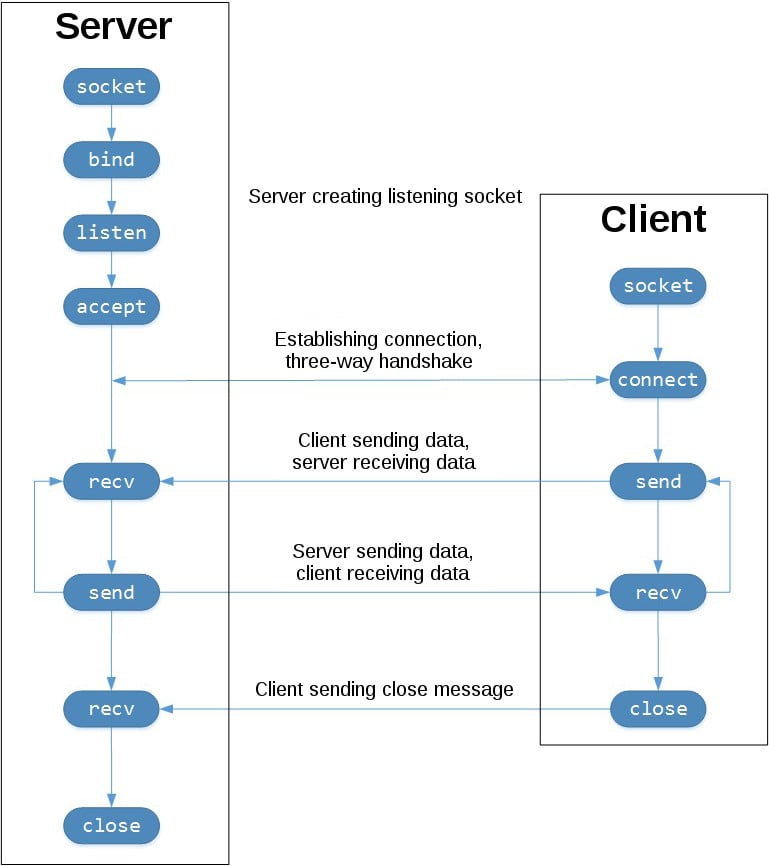

# Multi User RPC Service Design Document

## Overview

The web-lgsm utilizes a custom multi-user JSON RPC service to run specific
procedures as alternate users on the system. For example, in order to edit
another users crontab, the application utilizes the `edit_cron` procedure run
via the RPC service. This ensures code get's run as alternate users, without
the headache of using sudo to switch user contexts.

### Why JSON RPC?

A few reasons:

1. Speed - Way faster to make a request over a socket as compared to jobbing out to the shell
2. Security - Procedures are run as the user they're called by, no `sudo -u` root kerfuffle
3. Ergonomics - Nicer on me (the developer) to just make an rpc call for common things that need done as alt users

Also json is just simpler than setting up a whole GRPC wopaguz and defining
protos etc.

## Software Components

The following classes make up the web-lgsm RPC system.

* `agent.py` - Script for starting RPC servers as individual users
* `MultiUserRCPService` - Server & Client methods for handling socket communication
* `MultiUserRPCClient` - App side client code for communicating with RPC servers
* `MultiUserRPCServerManager` - App side code for restarting RPC servers
* `MultiUserRPCSupervisor` - App side code for ensuring servers are working before use

## SystemD Service

Each game server user get's setup with a `web-lgsm-agent` user level systemd
service at add/install time. This acts as the _RPC Server_ ready to receive
requests to run individual procedures.

```
mcserver@wopaguz:~$ systemctl --user status web-lgsm-agent
● web-lgsm-agent.service - Web-LGSM User Module Agent
     Loaded: loaded (/home/mcserver/.config/systemd/user/web-lgsm-agent.service; enabled; vendor preset: enabled)
     Active: active (running) since Sat 2026-08-01 21:11:50 EDT; 1 day 10h ago
   Main PID: 539052 (python3)
      Tasks: 1 (limit: 2216)
     Memory: 8.7M
        CPU: 96ms
     CGroup: /user.slice/user-1017.slice/user@1017.service/app.slice/web-lgsm-agent.service
             └─539052 /opt/web-lgsm/bin/python3 -m shared.agent

Aug 01 21:11:50 wopaguz.com systemd[955]: Started Web-LGSM User Module Agent.
Aug 01 21:11:50 wopaguz.com python3[539052]: INFO:rpc_server:Listening on: /run/web-lgsm/mcserver.sock
```

This systemd service will also be setup by the `web-lgsm.py` script during
"preflight checks" stage if it found to be missing or broken.

The agent (aka rpc server), also acts as a registry of available procedures
its able to run. Once it receives a request, it will call the procedure
specified in the request data with the supplied args and kwargs and return the
json formatted response.

### Why a SystemD Service?

Originally, during development I tried to run the RPC servers for each user via
`sudo -u` in their own threads. But that was messy and involved invoking root,
so long running processes were owned by root, so they weren't easily killable,
etc.

Rather than digging the hole deeper, I said they're their own thing, so just
let them be their own thing; A completely disconnected process, owned by a
different user, managed by systemd.

## Unix Domain Sockets

All communication between client and server happens over local Unix Domain
Sockets. This is the main responsibility of the `MultiUserRCPService` class. It
handles the socket communication for both client and server.



While the requests/responses themselves are packaged as JSON, everything sent
over the sockets is raw bytes. This requires a custom payload format used to
encode / decode data sent over the socket.

### Custom Payload Format

* First two bytes specify length of JSON content header
* JSON content header specifies `content_length` of the message
* JSON message containing rpc request / response data follows 

The `MultiUserRCPService` reads the first two bytes to determine how long the
json header is. Then it reads that number of bytes off the socket to fetch the
main body content length from the json header. Then it reads the number of
bytes specified in the json header off the socket to receive the full request /
response message.

### Why One Class for Server & Client?

Both the client and the server use the `MultiUserRCPService` class because
socket communication is symmetric. Both need to use the same send, receive, and
encode methods when handling TCP requests / responses.

## RPC Client, Manager, & Supervisor

On the main web-lgsm (aka gunicorn) application side of things, the client is
responsible for making json rpc requests and handling back responses.

For example:

```python
self.client.call('edit_cron', *args, **kwargs)
```

The problem is I'm a bad programmer and the RPC server is brittle and falls
over easily. That's where the `MultiUserRPCServerManager` comes in. It handles
stop, start, restart, and checking the status of the target RPC server to
ensure things are running smoothly.

In order to check the status of the RPC servers, the
`MultiUserRPCServerManager` uses the `MultiUserRPCClient`. However, we want to
check the server status before using the client to make the actual rpc server
request. This is where the `MultiUserRPCSupervisor` comes in.

The `MultiUserRPCSupervisor` is a facade to the underlying
`MultiUserRPCClient`. It runs a status check before every rpc request and
restarts the rpc server in question via the manager if there's a problem. That
way, to the user (programmer) utilizing the RPC client, if there is something
that's caused the rpc server to choke and fall over dead from a previous
request, it doesn't matter and will not hinder future rpc requests.

App Side Request Flow:

```
                 Class Utilizing RPC Client
                          |  1. Calls Procedure (ex `edit_cron`)
                          v
                 MultiUserRPCSupervisor -------------+
                      / 3. Restarts (if problem)     |  4. Uses Client to Make Request
                     v                               |
           MultiUserRPCServerManager                 |
                   / 2. Checks RPC Server Status     |
                  v                                  v
       MultiUserRPCClient                    MultiUserRPCClient
```

## An Exception for "Same User" Installs

The `MultiUserRPCClient` will bypass all of the above for same-user game server
installs. Instead, it just imports and runs the rpc procedures directly when
the game server is installed as the same user as the main web-lgsm app.

## Socket & SystemD Setup & Teardown

When a game server is installed or added via the web ui, the app will fire off
a playbook via the `ansible_connector.py` that sets up the socket file for that
game server and installs & start the systemd service.

Likewise, the `web-lgsm.py` script will now take care of double checking each
RPC server is running before starting the main app pid. This is useful because
the contents of `/run` are tmpfs and get cleared out on reboots.

Removing a game server will delete its files (if `remove_files = yes`),
cleaning up the systemd service for that game server user. And the
`uninstall.sh` script will cleanup the `/run/web-lgsm` dir.

## Sources

[Real Python - Socket Programming in Python](https://realpython.com/python-sockets/)


