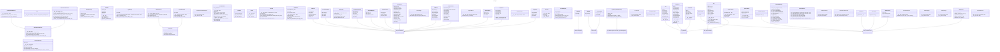

```mermaid
---
title: web-lgsm
---
classDiagram
    class AddForm {
        + Any server_id
        + Any install_type
        + Any install_name
        + Any install_path
        + list servers
        + Any script_name
        + Any username
        + Any install_host
    }

    class Audit {
        - \_\_init__(self, id, user_id, username, message, date_created) None
    }

    class AuditModel {
        + Any id
        + Any user_id
        + Any message
        + Any date_created
        + Any user
        - \_\_repr__(self) str
        - \_\_str__(self) str
    }

    class AuditRepository {
        + add(self, audit)
        + list(self, page, per_page, user_id, search)
        + count(self)
        + delete_oldest(self, number_to_delete)
    }

    class CommandExecutor {
        + Any USER
        - \_\_init__(self, config) None
        + get_local_executor(self)
        + get_ssh_executor(self)
        + get_executor(self, server_type, **kwargs)
        + run_command(self, cmd, server, cmd_id, app_context, timeout, **kwargs)
    }

    class BaseCommandExecutor {
        - \_\_init__(self) None
        - \_setup_proc_info(self, cmd_id, create)
        - \_process_output_line(self, line, output_type, proc_info)
        - \_log_wrap(self, stream_type, message)
        - \_process_raw_output(self, raw_line, proc_info, output_type)
    }

    class Blocklist {
        + int max_fail
        + list allowlist
        + list blocklist
        + list failed
        - \_\_new__(cls)
        + is_blocked(self, ip)
        + add_failed(self, ip)
        + get_client_ip(self, request)
    }

    class CfgManager {
        + Any USER
        - \_\_init__(self, executor, proc_info_service, command_exec_service) None
        + find_cfg_paths(self, server)
        + find_cfg_paths_ssh(self, server, valid_gs_cfgs)
    }

    class CmdOutput {
        + get(self, server_id)
    }

    class ColorField {
        + Any widget
    }

    class ConditionalPasswordRequired {
        - \_\_init__(self, message) None
        - \_\_call__(self, form, field)
    }

    class ConfigManager {
        + Any \_DEFAULTS
        - \_\_init__(self) None
        + reload(self)
        + get(self, section, option, fallback)
        - \_get_default(self, section, option)
        + getboolean(self, section, option, fallback)
        + getint(self, section, option, fallback)
        - \_\_getitem__(self, section)
        + set(self, section, option, value, immediate)
        + batch_update(self)
        - \_write_config(self)
    }

    class Container {
        + audit_repository(self)
        + log_audit_event(self)
        + list_audit_logs(self)
    }

    class Control {
        - \_\_init__(self) None
        - \_\_str__(self) str
        - \_\_repr__(self) str
    }

    class Controls {
        - \_\_init__(self, controls_file, exemptions_file) None
        + load_data(self)
        + get_controls(self, server, current_user)
        - \_filter_controls_by_permissions(self, controls_dict, current_user)
        + get_all_controls(self)
        + get_control_by_long_name(self, long_ctrl)
    }

    class CronService {
        + list CONNECTOR_CMD
        + Any config
        + Any command_service
        - \_\_init__(self, server_id) None
        + edit_job(self, job)
        + delete_job(self, job_id, del_db_entry)
        + list_jobs(self)
        + parse_cron_jobs(self, cron_text, target_uuid)
    }

    class DownloadCfgForm {
        + Any server_id
        + Any cfg_path
        + Any download_submit
    }

    class EditUsersForm {
        + Any selected_user
        + Any change_username_password
        + Any username
        + Any password1
        + Any password2
        + Any is_admin
        + Any enable_otp
        + list route_choices
        + Any routes
        + Any controls
        + Any server_ids
    }

    class FileInterface {
        - \_\_init__(self, server) None
        + read_file(self, file_path)
        + write_file(self, file_path, content)
    }

    class FileManager {
        - \_\_init__(self, server, executor) None
        + interface(self)
        + read_file(self, file_path)
        + write_file(self, file_path, content)
        + download_file(self, file_path)
    }

    class GameServer {
        + Any id
        + Any install_name
        + Any install_path
        + Any script_name
        + Any username
        + Any is_container
        + Any install_type
        + Any install_host
        + Any install_finished
        + Any install_failed
        + Any keyfile_path
        - \_\_repr__(self) str
        - \_\_str__(self) str
        + delete(self)
    }

    class GameServerDelete {
        + delete(self, server_id)
    }

    class Job {
        + Any id
        + Any server_id
        + Any command
        + Any comment
        + Any expression
        + Any date_created
        + Any game_server
        - \_\_repr__(self) str
        - \_\_str__(self) str
    }

    class JobsForm {
        + Any command
        + Any custom
        + Any comment
        + Any cron_expression
        + Any server_id
        + Any job_id
    }

    class ListAuditLogs {
        - \_\_init__(self, audit_repository) None
        + execute(self, page, per_page, user_id, search)
    }

    class LocalCommandExecutor {
        - \_\_init__(self, config) None
        + run(self, cmd, cmd_id, app_context, timeout)
        + get_output(self, proc, proc_info, output_type)
    }

    class LocalFileInterface {
        + Any USER
        - \_\_init__(self, server, executor) None
        + read_file(self, file_path)
        + write_file(self, file_path, content)
    }

    class LogAuditEvent {
        - \_\_init__(self, audit_repository, logger) None
        + execute(self, user_id, message)
    }

    class LoginForm {
        + Any username
        + Any password
        + Any otp_code
        + Any submit
    }

    class ManageCron {
        + check_perms(self)
        + validate_server_id(self, server_id)
        + get(self, server_id, job_id)
        + post(self, server_id, job_id)
        + delete(self, server_id, job_id)
    }

    class ModCurrentUser {
        - \_\_init__(self, role, permissions) None
    }

    class OTPSetupForm {
        + None user_id
        + Any otp_code
        + Any submit
    }

    class ProcInfo {
        - \_\_init__(self) None
        + toJSON(self)
        - \_\_str__(self) str
        - \_\_repr__(self) str
    }

    class ProcInfoRegistry {
        + Any processes
        - \_\_new__(cls)
        + get_all_processes(self)
        + add_process(self, server_id, proc_info)
        + get_process(self, server_id, create)
        + remove_process(self, server_id)
    }

    class SSHFileInterface {
        - \_get_ssh_key_file(self, user, host)
        - \_get_ssh_client(self, hostname, username, key_filename)
        + read_file(self, file_path)
        + write_file(self, file_path, content)
    }

    class SelectCfgForm {
        + Any server_id
        + Any cfg_path
    }

    class SendCommandForm {
        + Any send_form
        + Any server_id
        + Any control
        + Any send_cmd
        + Any submit
    }

    class ServerControlForm {
        + Any ctrl_form
        + Any server_id
        + Any control
        + Any submit
    }

    class ServerExists {
        - \_\_init__(self, message) None
        - \_\_call__(self, form, field)
    }

    class ServerPowerState {
        + get_status(self, server)
    }

    class ServerStatus {
        + get(self, server_id)
    }

    class SettingsForm {
        + Any text_color
        + Any graphs_primary
        + Any graphs_secondary
        + Any terminal_height
        + Any delete_user
        + Any remove_files
        + Any install_new_user
        + Any newline_ending
        + Any show_stderr
        + Any clear_output_on_reload
        + Any show_stats
        + Any purge_cache
        + Any update_weblgsm
        + Any submit
    }

    class SetupForm {
        + Any username
        + Any password1
        + Any password2
        + Any enable_otp
        + Any submit
        + validate_password1(self, field)
        + validate_password2(self, field)
    }

    class SqlAlchemyAuditRepository {
        + add(self, audit)
        + count(self)
        + delete_oldest(self, number_to_delete)
        + list(self, page, per_page, user_id, search)
    }

    class SshCommandExecutor {
        - \_\_init__(self, config) None
        - \_get_ssh_key_file(self, user, host)
        - \_get_ssh_client(self, hostname, username, key_filename)
        + run(self, cmd, cmd_id, app_context, timeout, server)
        + get_output(self, proc, proc_info, output_type)
        - \_read_ssh_output(self, channel, proc_info)
        - \_process_ssh_chunk(self, chunk, proc_info, output_type)
    }

    class SudoersService {
        + list CONNECTOR_CMD
        - \_\_init__(self, username) None
        + has_access(self)
        + add_user(self)
    }

    class SystemMetrics {
        + Any prev_bytes_sent
        + Any prev_bytes_recv
        + Any prev_time
        - \_\_init__(self) None
        + get_network_stats(self)
        + get_host_stats(self)
    }

    class SystemUsage {
        + get(self)
    }

    class TestConfigManager {
        + create_test_config(self, content)
        + cleanup_test_config(self)
        + test_init_with_defaults(self)
        + test_get_with_default_fallback(self)
        + test_get_with_custom_fallback(self)
        + test_getboolean(self)
        + test_getint(self)
        + test_set_method(self)
        + test_section_access(self)
        + test_nonexistent_section(self)
        + test_batch_update_context(self)
        + test_reload_method(self)
        + teardown_method(self)
    }

    class TestCronService {
        + test_create_job(self, db_session, client, add_mock_server)
        + test_delete_job(self, db_session, client, add_mock_server)
        + test_parse_cron_jobs_empty_input(self)
        + test_parse_cron_jobs_with_valid_job(self)
        + test_parse_cron_jobs_wrong_server(self)
        + test_edit_existing_job(self, db_session, add_mock_server)
    }

    class TestSystemMetrics {
        + test_get_network_stats(self)
        + test_get_host_stats(self)
    }

    class TmuxSocketNameCache {
        + del_socket_name_cache(self, server_id)
        + get_tmux_socket_name(self, server)
    }

    class UpdateConsole {
        + Any config
        + Any command_service
        + post(self, server_id)
    }

    class UploadTextForm {
        + Any server_id
        + Any cfg_path
        + Any file_contents
        + Any save_submit
    }

    class User {
        + Any id
        + Any username
        + Any password
        + Any role
        + Any permissions
        + Any date_created
        + Any otp_secret
        + Any otp_enabled
        + Any otp_setup
        - \_\_repr__(self) str
        - \_\_str__(self) str
        - \_\_init__(self, **kwargs) None
        + get_totp_uri(self)
        + verify_totp(self, token)
        + has_access(self, route, server_id)
    }

    class UserModuleService {
        - \_\_init__(self, module_dir) None
        + call(self, func_name, *args, as_user, **kwargs)
    }

    class ValidConfigFile {
        - \_\_init__(self, message) None
        - \_\_call__(self, form, field)
    }

    class ValidCronExpr {
        - \_\_init__(self, message) None
        - \_\_call__(self, form, field)
    }

    class ValidateID {
        + Any server_id
    }

    class ValidateOTPCode {
        - \_\_init__(self, user_id, message) None
        - \_\_call__(self, form, field)
    }

    LoginForm --|> flask_wtf.FlaskForm

    SetupForm --|> flask_wtf.FlaskForm

    OTPSetupForm --|> flask_wtf.FlaskForm

    EditUsersForm --|> flask_wtf.FlaskForm

    AddForm --|> flask_wtf.FlaskForm

    ColorField --|> wtforms.StringField

    SettingsForm --|> flask_wtf.FlaskForm

    UploadTextForm --|> flask_wtf.FlaskForm

    DownloadCfgForm --|> flask_wtf.FlaskForm

    SelectCfgForm --|> wtforms.Form

    ValidateID --|> wtforms.Form

    SendCommandForm --|> flask_wtf.FlaskForm

    ServerControlForm --|> flask_wtf.FlaskForm

    JobsForm --|> flask_wtf.FlaskForm

    SqlAlchemyAuditRepository --|> app.domain.repositories.audit_repo.AuditRepository

    AuditModel --|> app.db.Model

    SshCommandExecutor --|> BaseCommandExecutor

    BaseCommandExecutor ..|> CommandExecutor

    LocalCommandExecutor --|> BaseCommandExecutor

    ManageCron --|> flask_restful.Resource

    UpdateConsole --|> flask_restful.Resource

    ServerStatus --|> flask_restful.Resource

    CmdOutput --|> flask_restful.Resource

    GameServerDelete --|> flask_restful.Resource

    SystemUsage --|> flask_restful.Resource

    LocalFileInterface --|> FileInterface

    SSHFileInterface --|> FileInterface

    GameServer --|> app.db.Model

    Job --|> app.db.Model

    User --|> app.db.Model

    User --|> flask_login.UserMixin
```
