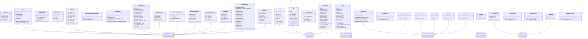

```mermaid
---
title: app
---
classDiagram
    class AddForm {
        + Any server_id
        + Any install_type
        + Any install_name
        + Any install_path
        + list servers
        + Any script_name
        + Any username
        + Any install_host
    }

    class Audit {
        + Any id
        + Any user_id
        + Any message
        + Any date_created
        + Any user
        - \_\_repr__(self) str
        - \_\_str__(self) str
    }

    class CmdDescriptor {
        - \_\_init__(self) None
        - \_\_str__(self) str
        - \_\_repr__(self) str
    }

    class CmdOutput {
        + get(self, server_id)
    }

    class ColorField {
        + Any widget
    }

    class ConditionalPasswordRequired {
        - \_\_init__(self, message) None
        - \_\_call__(self, form, field)
    }

    class CronService {
        - \_\_init__(self, server_id) None
        + edit_job(self, job)
        + delete_job(self, job_id, del_db_entry)
        + list_jobs(self)
        + parse_cron_jobs(self, cron_text, target_uuid)
    }

    class DownloadCfgForm {
        + Any server_id
        + Any cfg_path
        + Any download_submit
    }

    class EditUsersForm {
        + Any selected_user
        + Any change_username_password
        + Any username
        + Any password1
        + Any password2
        + Any is_admin
        + Any enable_otp
        + Any install_servers
        + Any add_servers
        + Any mod_settings
        + Any edit_cfgs
        + Any edit_jobs
        + Any delete_server
        + Any controls
        + Any server_ids
    }

    class GameServer {
        + Any id
        + Any install_name
        + Any install_path
        + Any script_name
        + Any username
        + Any is_container
        + Any install_type
        + Any install_host
        + Any install_finished
        + Any install_failed
        + Any keyfile_path
        - \_\_repr__(self) str
        - \_\_str__(self) str
        + delete(self)
    }

    class GameServerDelete {
        + delete(self, server_id)
    }

    class InstallForm {
        + Any servers
        + list short_names
        + list long_names
        + Any script_name
        + Any full_name
    }

    class Job {
        + Any id
        + Any server_id
        + Any command
        + Any comment
        + Any expression
        + Any date_created
        + Any game_server
        - \_\_repr__(self) str
        - \_\_str__(self) str
    }

    class JobsForm {
        + Any command
        + Any custom
        + Any comment
        + Any cron_expression
        + Any server_id
        + Any job_id
    }

    class LoginForm {
        + Any username
        + Any password
        + Any otp_code
        + Any submit
    }

    class ManageCron {
        + check_perms(self)
        + validate_server_id(self, server_id)
        + get(self, server_id, job_id)
        + post(self, server_id, job_id)
        + delete(self, server_id, job_id)
    }

    class OTPSetupForm {
        + None user_id
        + Any otp_code
        + Any submit
    }

    class ProcInfoVessel {
        - \_\_init__(self) None
        + toJSON(self)
        - \_\_str__(self) str
        - \_\_repr__(self) str
    }

    class SelectCfgForm {
        + Any server_id
        + Any cfg_path
    }

    class SendCommandForm {
        + Any send_form
        + Any server_id
        + Any command
        + Any send_cmd
        + Any submit
    }

    class ServerControlForm {
        + Any ctrl_form
        + Any server_id
        + Any command
        + Any submit
    }

    class ServerExists {
        - \_\_init__(self, message) None
        - \_\_call__(self, form, field)
    }

    class ServerStatus {
        + get(self, server_id)
    }

    class SettingsForm {
        + Any text_color
        + Any graphs_primary
        + Any graphs_secondary
        + Any terminal_height
        + Any delete_user
        + Any remove_files
        + Any install_new_user
        + Any newline_ending
        + Any show_stderr
        + Any clear_output_on_reload
        + Any show_stats
        + Any purge_tmux_cache
        + Any update_weblgsm
        + Any submit
    }

    class SetupForm {
        + Any username
        + Any password1
        + Any password2
        + Any enable_otp
        + Any submit
        + validate_password1(self, field)
        + validate_password2(self, field)
    }

    class SystemUsage {
        + get(self)
    }

    class UpdateConsole {
        + post(self, server_id)
    }

    class UploadTextForm {
        + Any server_id
        + Any cfg_path
        + Any file_contents
        + Any save_submit
    }

    class User {
        + Any id
        + Any username
        + Any password
        + Any role
        + Any permissions
        + Any date_created
        + Any otp_secret
        + Any otp_enabled
        + Any otp_setup
        - \_\_repr__(self) str
        - \_\_str__(self) str
        - \_\_init__(self, **kwargs) None
        + get_totp_uri(self)
        + verify_totp(self, token)
    }

    class ValidConfigFile {
        - \_\_init__(self, message) None
        - \_\_call__(self, form, field)
    }

    class ValidCronExpr {
        - \_\_init__(self, message) None
        - \_\_call__(self, form, field)
    }

    class ValidateID {
        + Any server_id
    }

    class ValidateOTPCode {
        - \_\_init__(self, user_id, message) None
        - \_\_call__(self, form, field)
    }

    LoginForm --|> flask_wtf.FlaskForm

    SetupForm --|> flask_wtf.FlaskForm

    OTPSetupForm --|> flask_wtf.FlaskForm

    AddForm --|> flask_wtf.FlaskForm

    ColorField --|> wtforms.StringField

    SettingsForm --|> flask_wtf.FlaskForm

    UploadTextForm --|> flask_wtf.FlaskForm

    DownloadCfgForm --|> flask_wtf.FlaskForm

    SelectCfgForm --|> wtforms.Form

    ValidateID --|> wtforms.Form

    SendCommandForm --|> flask_wtf.FlaskForm

    ServerControlForm --|> flask_wtf.FlaskForm

    InstallForm --|> flask_wtf.FlaskForm

    EditUsersForm --|> flask_wtf.FlaskForm

    JobsForm --|> flask_wtf.FlaskForm

    ManageCron --|> flask_restful.Resource

    UpdateConsole --|> flask_restful.Resource

    ServerStatus --|> flask_restful.Resource

    SystemUsage --|> flask_restful.Resource

    CmdOutput --|> flask_restful.Resource

    GameServerDelete --|> flask_restful.Resource

    Audit --|> app.db.Model

    Job --|> app.db.Model

    User --|> app.db.Model

    User --|> flask_login.UserMixin

    GameServer --|> app.db.Model
```
