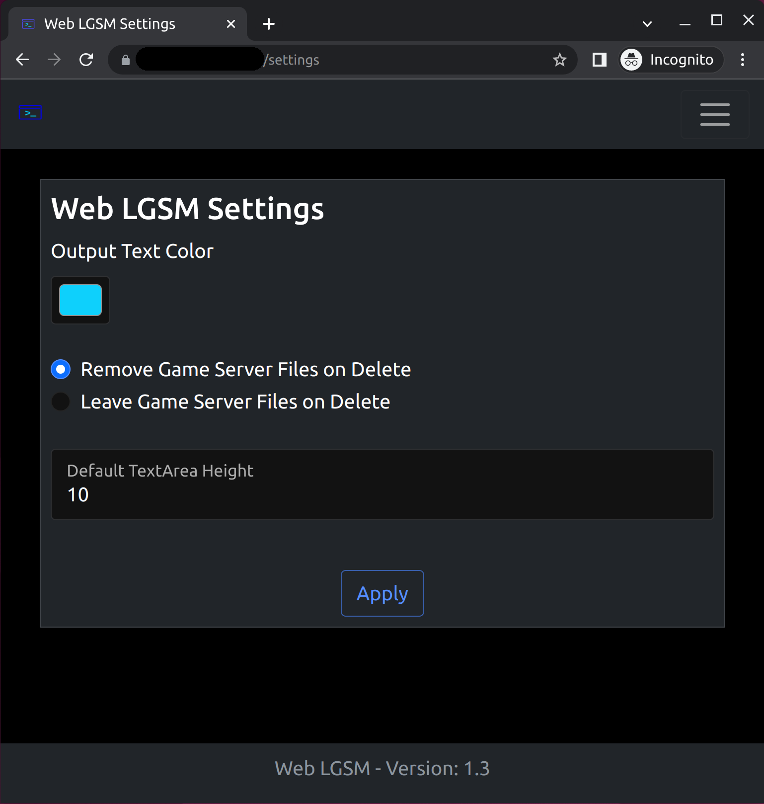

# How to Update the Web LGSM

There are two different ways to check for and update the web-lgsm. Users can
update the app either through the web interface. Or via the `update.sh` cli
script. Using one of these methods rather than `git pull` is preferable because
it will preserve and backup the users existing `main.conf` file.

From within the web interface, on the *Settings* page, you'll find a checkbox
for "Check for and update the Web LGSM!". If you check this box and then click
apply, the web-lgsm will check for and download / apply any necessary updates
via git.



Alternatively, CLI users can run the update script directly by cd'ing to the
web-lgsm directory and then running, `./scripts/update.sh`. The `update.sh`
script supports a few optional args, which you can see if you run it with `-h`.

```
» ./scripts/update.sh -h
Usage:
      update.sh [options]

 -h     Print this help menu
 -a     Auto mode, no prompts
 -c     check mode, does NOT update
```

You can also use this script on a cronjob to enable auto updates for the
project if you would like. More info about that can be found in the [How to
Enable Auto Updates](how_to_enable_auto_updates.md) doc on the subject.
